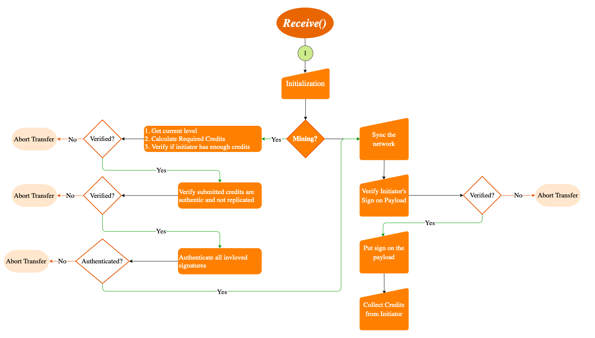

# Quorum

### Quorum Consensus - *Public Function*
### Function: *Implements Runnable*
### Parameters: *-*
### Return: *-*

## Main Components
1. Initialization 
2. Consensus Checks for Mining 
3. Consensus for Transaction

> *Note: The flow is considering all success codes received by the initiator during the whole process*  
*In any case of failure or transaction abortion, the nodes will recover and return to listening*

### INITIALIZATION
1. IPFS repo gc
2. Logger configuration
3. Setting credits path directory
4. IPFS listen

### CONSENSUS CHECKS FOR MINING
1. Get the current level for mining to calculate required number of credits to be pledged by initiator
2. Verify all credits submitted are authentic and not replicated
3. Authenticate all signatures of each credit submitted for the mining

### CONSENSUS FOR TRANSACTION
1. Sync the network
2. Verify the initiator's sign on payload
3. Put sign on the payload and send to the initiator
4. Collect credits from the initiator

> *Credits are 15 signatures accumulated by the initiator for the current transaction and distributed to all the signing quorum nodes*