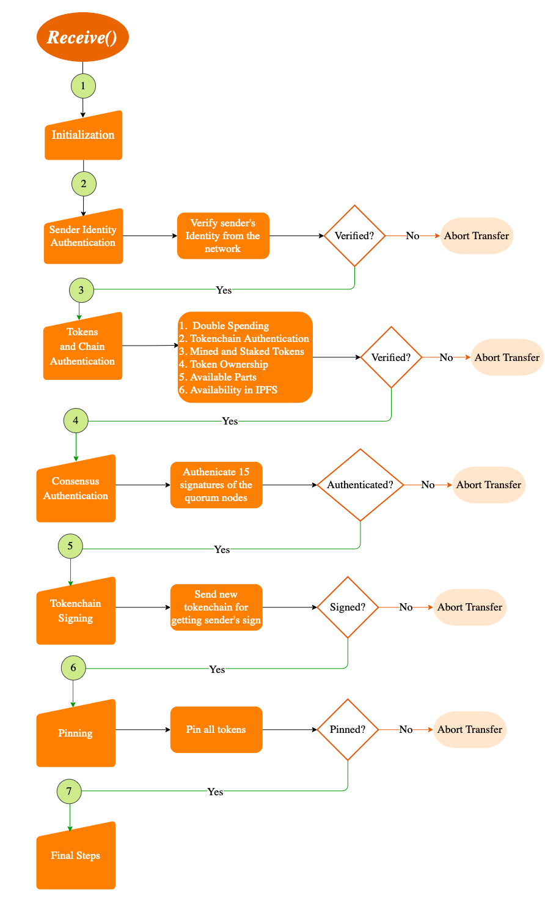

# Receiver

### Token Receiver - *Public Function*
### Function name: *Receive*
### Parameters: *-*
### Return: *String*

## Main Components
1. Initialization 
2. Sender Identity Authentication 
3. Tokens and chains Authentication 
4. Consensus Authentication 
5. Get the token chain signed 
6. Pinning 
7. Final steps

> *Note: The flow is considering all success codes received by the receiver and quorum during the whole transfer*
*In any case of failure or transaction abortion, the failure message will be returned to the API*

### INITIALIZATION
1. IPFS repo gc 
2. Setting part tokens and chain path directory 
3. Logger configuration 
4. IPFS listen

### SENDER IDENTITY AUTHENTICATION
1. Swarm connect with sender peer id 
2. Fetch DID and WID from datatable with PID received 
3. Check the format of the IDs 
4. Fetch Images from network if not present

### TOKENS AND TOKEN CHAINS AUTHENTICATION
1. Double spending 
   - Number of pins on token check 
   - Hash pin check
2. Tokenchain authenticity 
3. Mined and Staked tokens 
4. Ownership 
5. Available parts 
6. Tokens and chains availability in IPFS 

#### A. DOUBLE SPENDING
- Number of pins on the token
  1. Find out how many nodes can provide the token content (Only one should - the current sender)
  2. If there are more, cross verify if they are in the previous senders list from the tokenchain (should be present)
  3. If only legitimate nodes provide the content, the check is passed
- Hash pin check
  1. Check how many pins are there on the consensus ID (only one of the sender's)
  2. If the above 2 conditions pass, then this check pass
#### B. TOKENS AUTHENTICITY  
Recalculates the hash for the chain and verifies the signature on the hash put by the previous sender of this token
#### C. MINED AND STAKED TOKENS
- Mined Tokens  
    Checks if the staked token is still staked if the current mined token have not reached the required height for releasing of stake
- Staked Tokens  
    Checks if the corresponding mined token has reached the required height for this token to be released 
#### D. OWNERSHIP
Checks if the owner identity calculated in the previous transfer of this token is authentic
#### E. AVAILABLE PARTS
Accepts the part toke is it has required parts available to be received
#### F. TOKENS AND CHAINS IPFS AVAILABILITY
Check if all the tokens and chains files are available in ipfs to be fetched

### CONSENSUS 
1. Assemble the following data for consensus  
   - Tid
   - Message
   - Receiver DID
   - Private share location of the sender
   - Tokens
   - Alpha beta and gamma list
2. Run consensus

### AUTHENTICATE CONSENSUS DETAILS BY THE RECEIVER
Send the status (Consensus Reached or failed) and quorum signatures to the receiver for verification

### SIGN TOKEN-CHAIN FOR IMMUTABILITY
1. Request the receiver to provide the new blocks being added to the token-chain
2. Hash and Sign the whole token-chain for every token transferred (to be added in receiver side)
3. Hashes and Signatures of respective token-chains will be sent back to the receiver

### UNPINNING
1. Unpin all tokens from the local node  
2. Repo GC 
3. Once acknowledged by receiver send the essential share

### FINAL STEPS
1. Update the quorum to the advisory node to release the quorum for other transfers  
2. Update the Transaction History file 
3. Delete the whole tokens from the folder 
4. Delete the part tokens from the folder IF the whole token has been spent 
5. Update the Part token chain with the latest transfer 
6. Send the following data to the explorer  
   - Tid 
   - Sender DID 
   - Receiver DID 
   - Tokens 
   - Total time 
   - Amount 
7. Return JSONObject to API
