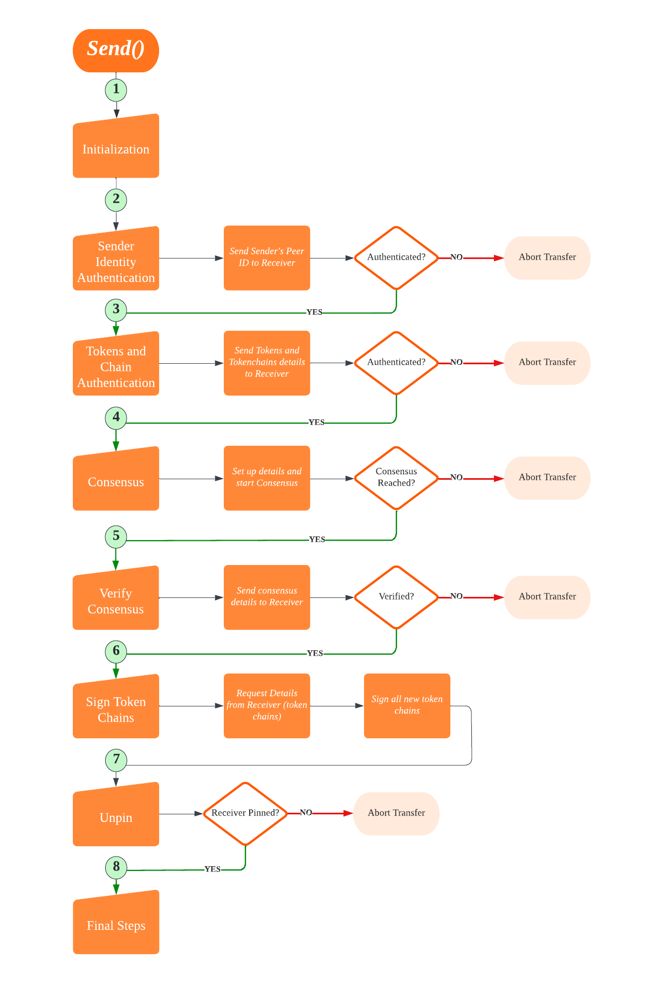

# Sender

### Token Sender - *Public Function*
### Function name: *Send*
### Parameters: *data(String), ipfs(IPFS), port(Integer)*
### Return: *JSONObject*

## Main Components
1. Initialization
2. Sender Auth by Receiver
3. Tokens and chains Auth by Receiver
4. Consensus
5. Unpinning
6. Final steps

> *Note: The flow is considering all success codes received by the receiver and quorum during the whole transfer*
*In any case of failure or transaction abortion, the failure message will be returned to the API*

### INITIALIZATION
1. Ipfs repo 
2. Set loggers
3. Sanity check for Receiver  
4. Set tokens and token-chains (Whole and Parts)
5. Calculate the payload hash 
6. Calculate Transaction ID, tid = Hash of Payload hash
7. Recalculate the ownership hash 
8. Arrange and set the quorum details ready for consensus 
9. Sanity check and credit check for the quorums 
10. Swarm connect with all quorums
11. Sync dataTable  
12. Swarm connect with receiver  
13. IPFS forward with Receiver  

### SENDER IDENTITY AUTHENTICATION
Send the sender Peer ID for sender authentication by Receiver

### TOKENS AND TOKEN CHAINS AUTHENTICATION
1. Calculate the double spent hash 
2. Send the following details of tokens and token chains to the receiver for authentication 
   - List of whole tokens
   - List of whole token chains
   - List of part tokens
   - List of part token chains
   - Sender’s DID
   - List of previous senders from each token-chain
   - Recalculated token ownership
   - The amount that is currently being sent
   - Amount ledger for each part token to keep track of how much part of the token has already been spent (how much of a token is remaining in parts to be sent)

CONSENSUS SET UP  
Assemble the following data for consensus  
   - Tid
   - Message
   - Receiver DID
   - Private share location of the sender
   - Tokens
   - Alpha beta and gamma list

### AUTHENTICATE CONSENSUS DETAILS BY THE RECEIVER
Send the status (Consensus Reached or failed) and quorum signatures to the receiver for verification

### UNPINNING
1. Unpin all tokens from the local node  
2. Repo GC 
3. Once acknowledged by receiver send the essential share

### FINAL STEPS
1. Update the quorum to the advisory node to release the quorum for other transfers  
2. Update the Transaction History file 
3. Delete the whole tokens from the folder 
4. Delete the part tokens from the folder IF the whole token has been spent 
5. Update the Part token chain with the latest transfer 
6. Send the following data to the explorer  
   - Tid 
   - Sender DID 
   - Receiver DID 
   - Tokens 
   - Total time 
   - Amount 
7. Return JSONObject to API
